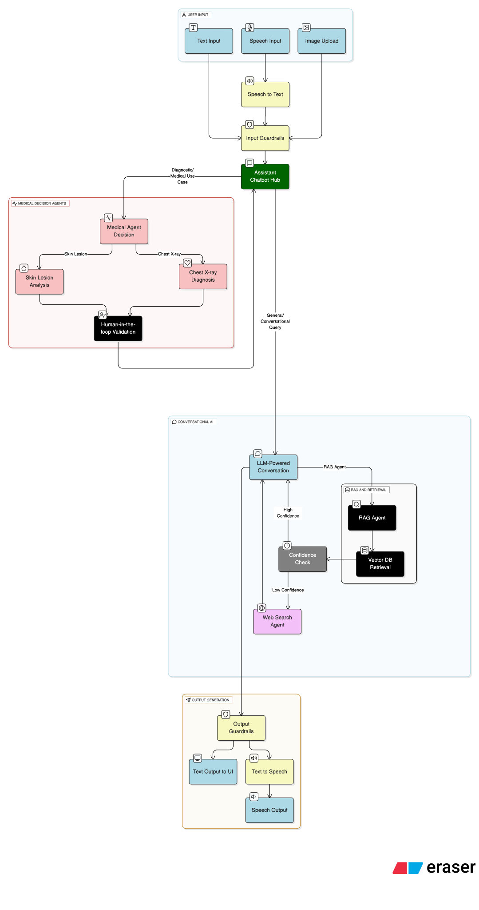

<h1 align="center"><strong>MedAid 🩺 <h6 align="center">A Bi-Modal Multi-Agent Medical Assistant</h6></strong></h1>

## Table of Contents

- [Overview](#overview)
- [Flow Chart](#flowchart)
- [Features](#features)
- [Technology Stack](#tech-stack)
- [Project Setup](#setup)

---

## Overview 

**MedAid** is an **AI-powered assistant** designed to assist with **medical diagnosis, research, and patient interactions**.

This project integrates LLMs, CV Models, RAG, Web Search and Human-in-the-loop validation for AI based medical diagnosis and research.

---

## Flow Chart



---

## Features {features}

- **Multi-Agent Architecture** : Specialized agents to handle diagnosis, information retrieval, reasoning, image analysis and more
- 🔍 **Advanced Agentic RAG Retrieval System** :

  - Docling based parsing to extract text, tables, and images from PDFs.
  - Embedding markdown formatted text, tables and LLM based image summaries.
  - LLM based semantic chunking with structural boundary awareness.
  - LLM based query expansion with related medical domain terms.
  - Qdrant hybrid search combining BM25 sparse keyword search along with dense embedding vector search.
  - HuggingFace Cross-Encoder based reranking of retrieved document chunks for accurate LLM reponses.
  - Input-output guardrails to ensure safe and relevant responses.
  - Links to source documents and images present in reference document chunks provided with reponse.
  - Confidence-based agent-to-agent handoff between RAG and Web Search to prevent hallucinations.
- 🏥 **Medical Imaging Analysis**

  - Brain Tumor Detection (TBD)
  - Chest X-ray Disease Classification
  - Skin Lesion Segmentation
- 🌐 **Real-time Research Integration** : Web search agent that retrieves the latest medical research papers and findings
- 📊 **Confidence-Based Verification** : Log probability analysis ensures high accuracy in medical recommendations
- 🎙️ **Voice Interaction Capabilities** : Seamless speech-to-text and text-to-speech powered by Eleven Labs API
- 👩‍⚕️ **Expert Oversight System** : Human-in-the-loop verification by medical professionals before finalizing outputs
- ⚔️ **Input & Output Guardrails** : Ensures safe, unbiased, and reliable medical responses while filtering out harmful or misleading content
- 💻 **Intuitive User Interface** : Designed for healthcare professionals with minimal technical expertise

---

## Technology Used {tech-stack}

| Component                          | Technologies                                    |
| ---------------------------------- | ----------------------------------------------- |
| 🔹**Backend**                | FastAPI                                         |
| 🔹**Agent Orchestration**    | LangGraph                                       |
| 🔹**Document Parsing**       | Docling                                         |
| 🔹**Knowledge Storage**      | Qdrant Vector Database                          |
| 🔹**Medical Image Analysis** | Computer Vision Models                          |
|                                    | • Chest X-Ray: Image Classification (PyTorch)  |
|                                    | • Skin Lesion: Semantic Segmentation (PyTorch) |
| 🔹**Guardrails**             | LangChain                                       |
| 🔹**Speech Processing**      | Eleven Labs API                                 |
| 🔹**Frontend**               | HTML, CSS, JavaScript                           |

---

## Project Setup {setup}

### 1️⃣ Clone the Repository

```bash
git clone https://github.com/vedprakashnautiyal/MedAid.git
cd MedAid
```

### 2️⃣ Create Environment File

- Create a `.env` file in the root directory and add API keys or other environment variables:

```bash
# Speech API Key 
ELEVEN_LABS_API_KEY=

# Web Search API Key
TAVILY_API_KEY=

# Hugging Face Token (For ReRanker Model -  "ms-marco-TinyBERT-L-6" )
HUGGINGFACE_TOKEN=

# For Gemini API (Can use other LLMs like Ollama Based or OpenAI but need code modification)
GOOGLE_API_KEY=
```

### 3️⃣ Create & Activate Virtual Environment

```bash
python -m venv .medaid
source .medaid/bin/activate  # For Mac/Linux
.medaid\Scripts\activate     # For Windows  
```

### 4️⃣ Install Dependencies

> **[NOTE]**
> ffmpeg is required for speech service to work.

```bash
winget install ffmpeg
```

```bash
pip install -r requirements.txt  
```

### 5️⃣ Ingest Data into Vector DB

- To ingest one document at a time:

```bash
python ingest_rag_data.py --file ./data/raw/brain_tumors_ucni.pdf
```

- To ingest multiple documents from a directory:

```bash
python ingest_rag_data.py --dir ./data/raw
```

### 6️⃣ Run the Project

```bash
python app.py
```

The application will be available at: [http://localhost:8000](http://localhost:8000)

[**🔝 Return**](#top)

---
